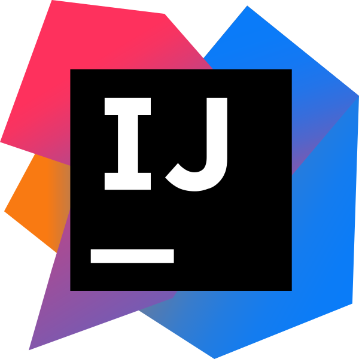

### Hi there, I'm Nacho 👋

## I'm a backend software engineer from Argentina 🇦🇷 living in the UK 🇬🇧

- 🔭 I work in finance and used to work for [MercadoLibre](http://mercadolibre.com.ar/)
- 🌱 I’m currently trying to become a fuller-stack dev 🤣 and writing medium articles
- 🥅 Goal: Start collaborating with more open source projects and eventually have one of my own
- ⚡ Fun fact: I love heavy metal, football 💙 💛 💙 and i'm big fan of James Bond movies

---

### 📕 Latest Medium Articles

<!-- BLOG-POST-LIST:START -->
- [Docker + Kubernetes + Helm: A comprehensive step-by-step using Java](https://ignaciocicero.medium.com/docker-kubernetes-helm-a-comprehensive-step-by-step-using-java-df83f6780d80?source=rss-f0b17d049285------2)
- [Alternative query tooling for Java](https://ignaciocicero.medium.com/alternatives-query-tooling-for-java-27da9822b980?source=rss-f0b17d049285------2)
<!-- BLOG-POST-LIST:END -->

---

### Connect with me:

[][website]
[][medium]
[][twitter]
[][linkedin]
[][instagram]

[website]: https://nacho270.github.io/
[medium]: https://ignaciocicero.medium.com/
[twitter]: https://twitter.com/ignaciocicero
[instagram]: https://instagram.com/nacho_270
[linkedin]: https://linkedin.com/in/icicero

 

---

### Languages:

 

### Tools:

 

### IDEs:

 
 

---

### :zap: Github stats

             

---

###  [My spotify playlists](https://github.com/nacho270/spotify-playlists-github-action)  

<!-- MY_PLAYLISTS:START-->

<!-- MY_PLAYLISTS:END-->
